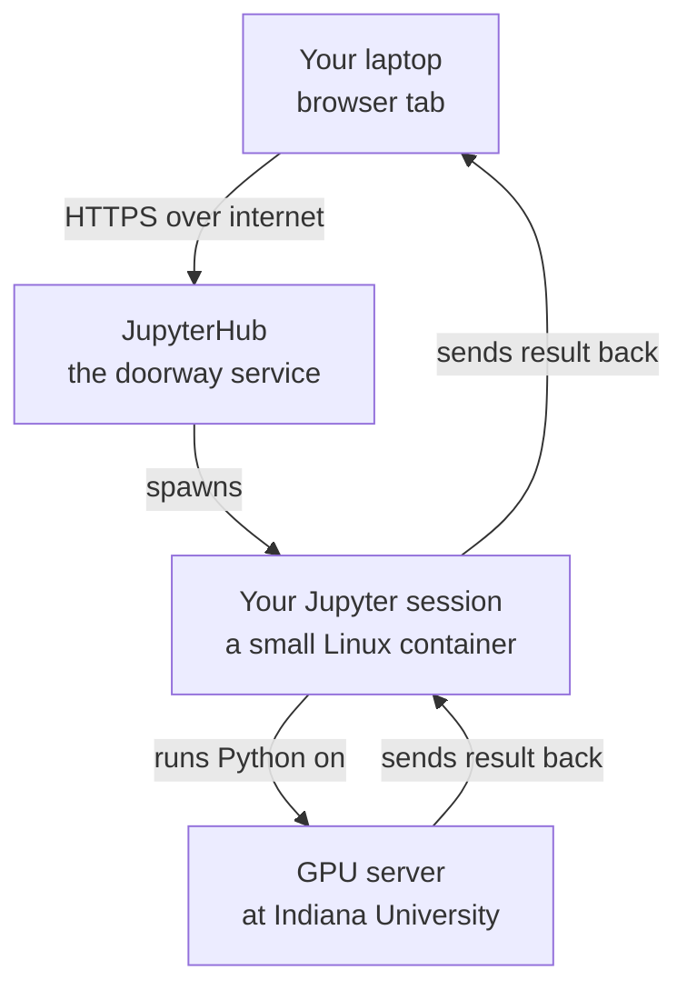
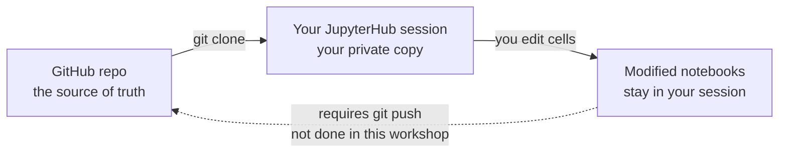

# Concepts & Architecture

Before any code, here's the map of how all the pieces fit together. This document is the reference you can come back to whenever something feels confusing — *"wait, is that the Jupyter thing or the Jetstream thing?"*

## TL;DR — If You Remember Nothing Else

1. **ACCESS gives you an identity** that lets you use NAIRR resources.
2. **Jetstream2 is the computer**, **JupyterHub is the doorway** to that computer, and **Jupyter notebooks are the worksheets** you run on it.
3. **The notebooks live on GitHub**, get pulled into your JupyterHub session, and your edits stay in your session unless you explicitly push them back.

---

## 1. The Players

Six things to know by name. We'll use these terms throughout the workshop.

### ACCESS

**What it is:** A national identity-and-allocation system for NSF-funded research computing (formerly called XSEDE).

**What it does for you:** Think of it as your **library card** for a whole network of research computers. You register once at [access-ci.org](https://access-ci.org), get an ACCESS ID, and the same ID works across many systems — including NAIRR.

### NAIRR (National AI Research Resource)

**What it is:** A pilot program that gives researchers access to AI compute (GPUs, datasets, pretrained models).

**What it does for you:** NAIRR is one of the **catalogs of resources** that ACCESS administers. You don't log into "NAIRR" directly — you log into the specific resource it provides for your project (in our case, Jetstream2).

### Jetstream2

**What it is:** The **cloud computer** NAIRR provides for this workshop. Operated by Indiana University, it has thousands of GPUs available for research use.

**Vocabulary note:** In Jetstream2's language, "an instance" = a virtual computer they spin up for you.

### JupyterHub

**What it is:** The **front door** to running Jupyter notebooks on Jetstream2.

**What it does for you:** When you click "spawn", JupyterHub starts a small personal server for you on Jetstream2 and gives you a notebook environment in your browser. The URL we'll use:

```
https://hub.nairr250048.projects.jetstream-cloud.org/hub/spawn
```

### GitHub (this repository)

**What it is:** Where the **workshop materials live** — slides, notebooks, exercises. Public, version-controlled, the source of truth.

**What it does for you:** When you "get the notebooks", you're copying them from GitHub into wherever you're running them (your JupyterHub session, or your laptop).

### Your laptop

**What it is:** Where your browser runs and where you click around to log in.

**Optional role:** You can also run the notebooks **locally** on your laptop instead of in the cloud — useful for offline practice, but you'll miss out on the GPU.

---

## 2. The Credential Chain

You can't just walk up and log into Jetstream2. There's a sequence — and each step depends on the previous one.


### Why the order matters

- If you try to log into Jetstream2 **without** an ACCESS ID → it can't authenticate you.
- If you have an ACCESS ID but **haven't been added** to a NAIRR allocation → you can authenticate, but you don't have permission to use any resources.
- If you have an allocation but Jetstream2 thinks your session expired → you'll need to re-authenticate before spawning JupyterHub.

### What each step actually is

1. **Create ACCESS ID** — Go to [access-ci.org](https://access-ci.org) → register. You'll choose to either link your institutional login (single sign-on via your university) or create a standalone ACCESS-only account.

   > [!IMPORTANT]
   > **CONFIRM:** From your workshop experience — did you use your institutional SSO or a standalone ACCESS account? This affects what we tell attendees to expect.

2. **Be added to a NAIRR allocation** — Someone who manages a NAIRR allocation (the PI or workshop coordinator) adds your ACCESS ID as a member. **You can't add yourself** — you need to be invited.

3. **Log into Jetstream2** — Use your ACCESS ID at the Jetstream2 portal. Behind the scenes this uses **CILogon**, a federated identity service that connects ACCESS to institutional identity providers. You don't interact with CILogon directly; it just appears in the login flow.

4. **Spawn a JupyterHub session** — Visit the JupyterHub URL above, sign in (uses your ACCESS ID again), then click "Start" or "Spawn". A small server boots up for you. This takes roughly 30 seconds.

### Key takeaway

> Your ACCESS ID is the master key — every step uses it. Don't create multiple accounts.

---

## 3. What Runs Where (the Compute Stack)

When you press **Shift+Enter** in a notebook cell, where does that code actually run? Answer: **not on your laptop.**



### The journey of one cell run

1. You type code in your browser. **The browser is just a window** — no computation happens here.
2. You press Shift+Enter. The browser sends the code text up to JupyterHub.
3. JupyterHub forwards it to **your personal Jupyter server**, a small Linux container that was started just for you when you spawned.
4. That server has a **kernel** — the actual Python interpreter that runs your code. If your spawn options selected a GPU, the kernel has access to GPU hardware on the Jetstream2 cluster.
5. The kernel runs the code, generates output (numbers, text, images, charts), and sends it back through the same path to your browser.

### Why this matters for non-coders

- **Things will feel slow sometimes.** That's not your laptop being slow — that's a real network round trip to Indiana.
- **Closing the browser tab does NOT kill your kernel.** Your session keeps running until JupyterHub times it out (typically after a period of inactivity). If you come back, your variables and loaded data are still there.
- **If the kernel crashes or you "Restart Kernel"**, everything in memory is gone — you have to re-run the cells from the top.

### Key takeaway

> Your browser is a remote control. The actual computer is in Indiana.

---

## 4. Where the Notebooks Come From

The notebooks (`.ipynb` files) are **not** sitting inside JupyterHub by default. They live in this **GitHub repository** and need to be pulled into your session.



### The three states of a notebook

1. **On GitHub** — the original, public, shared with the world. Only repository maintainers can change this.
2. **In your JupyterHub session** — a copy that landed in your session's storage when you (or a workshop helper script) pulled the repo. Only you see this copy.
3. **Edited by you** — your changes save into your session's persistent storage. They stick around between sessions as long as your NAIRR account is active.

### Common confusion: am I editing GitHub?

> ❓ *"If I edit a notebook in JupyterHub, am I changing the version on GitHub?"*
>
> **No.** Your edits stay in your session. To share changes back to GitHub, you'd need to run `git push`, which requires GitHub credentials. **For workshop attendees, this isn't needed** — your edits are your private workspace.

### How the notebooks get into your session

There are a few common ways. The workshop will tell you which one to use:

- **Option A — Terminal command.** Open a terminal in JupyterLab and run:
  ```bash
  git clone https://github.com/TheAIHorizon/NAIRR_Workshops.git
  ```
- **Option B — nbgitpuller link.** A specially-formatted URL that auto-clones the repo when you click it. The workshop hosts publish these links.
- **Option C — Manual upload.** Drag-and-drop the `.ipynb` files from your laptop into the JupyterLab file browser.

> [!IMPORTANT]
> **CONFIRM:** Which method did the workshop you attended use? This tells us what to document as the primary path for our attendees.

### Key takeaway

> GitHub is the source. Your JupyterHub session is your sandbox. **The two are not auto-synced.**

---

## 5. Local vs Cloud — When to Use Which

You have two ways to run the workshop notebooks. Here's the comparison:

|                          | **Local (your laptop)**                  | **Cloud (JupyterHub on Jetstream2)** |
|--------------------------|------------------------------------------|--------------------------------------|
| Where code runs          | Your laptop's CPU/GPU                    | Jetstream2 GPU server                |
| Setup effort             | Install Python, create venv, pip install | Click "Spawn", done                  |
| GPU access               | Whatever your laptop has (often none)    | Yes — real research-grade GPU        |
| Storage                  | Your laptop's disk                       | Your session's cloud storage         |
| Works offline            | Yes                                      | No (needs internet)                  |
| Environment consistency  | Depends on your install                  | Identical for everyone               |
| Counts against NAIRR allocation | No                                | Yes                                  |
| Best for                 | Quick experiments, offline work          | Heavy compute, big datasets, GPU work |

### Our recommendation for the workshop

**Use the cloud version.** Setup is one click, you get a GPU for free during the workshop, and everyone has the same environment — so when something goes wrong, it's reproducible and fixable for everyone at once.

### When local makes sense

After the workshop, if you want to keep practicing without consuming your NAIRR allocation, the local setup is a good fallback. It won't have a GPU (unless your laptop has one), but for learning notebook basics that's fine.

### Key takeaway

> Cloud first. Local is the backup.

---

## Glossary

Terms that come up often but get assumed:

| Term | What it means |
|------|---------------|
| **Cell** | One block of code (or markdown) in a notebook. Code cells show `[ ]` on the left. |
| **Run a cell** | Send its code to the kernel and display the result. Shortcut: **Shift+Enter**. |
| **Kernel** | The Python interpreter behind your notebook. *"Restart the kernel"* = wipe in-memory state and start fresh. |
| **Notebook** | A `.ipynb` file mixing code cells and markdown explanation. Reads top-to-bottom like a worksheet. |
| **JupyterLab** | The web interface you're using inside the JupyterHub session (file browser, editor, terminal, etc.). |
| **venv** | "Virtual environment." An isolated Python install for one project, so its packages don't clash with other Python on your computer. |
| **GPU** | Graphics Processing Unit. Despite the name, used heavily for AI because it's fast at the math AI models need. |
| **Instance** | (Jetstream2 vocabulary) A virtual computer running on Jetstream2's hardware. |
| **Container** | A lightweight isolated environment bundling a program plus its dependencies. Your JupyterHub session runs in one. |
| **CILogon** | A federated single-sign-on service. You'll see it during ACCESS login but never need to interact with it directly. |
| **PI** | Principal Investigator — the researcher who owns a NAIRR allocation and can add/remove members. |
| **Allocation** | A budget of compute time granted to a project. You consume it when you run jobs on Jetstream2. |

---

## Where to Go Next

- Look at the [workshop slides](slides/) for the visual version of much of this material.
- Open [`notebooks/00_Jupyter_Crashcourse.ipynb`](notebooks/00_Jupyter_Crashcourse.ipynb) to see Jupyter itself in action.
- If you get lost on terminology, come back to this document.
